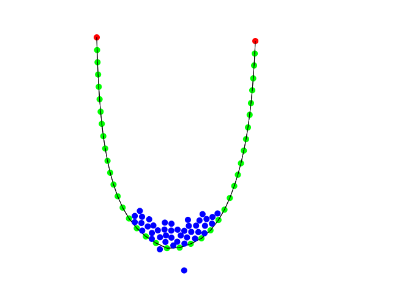

# PhysicsEngine
Basic 2D physics

# Example

## Are you looking for how to manage your virtual universe?

### Click
- Spawns entities that has gravity

### Hold -> Z/X/C.... -> Mouse Up
- Spawns entities that are connected each other

### Hold -> Click
- Gravity entity

### Hold -> Z
- Non-gravity entity

### Hold -> X
- Non-gravity and non-colliding entity

### Hold -> C
- Gravity and killer entity